# 日本人流時序預測與生成模型

針對日本四個城市的人流資料，進行時序預測與空間生成建模，涵蓋 **LSTM、cGAN、Diffusion Model** 三種深度學習方法。

---

## 資料集

| 項目 | 內容 |
| ---- | ---- |
| 來源 | 日本四城市匿名移動軌跡資料 |
| 城市 | City A（名古屋）/ City B（廣島）/ City C（札幌）/ City D（熊本） |
| 總筆數 | 約 **1.6 億筆** |
| 欄位 | `uid`（使用者）、`d`（天）、`t`（30 分鐘時間槽）、`x`、`y`（網格座標） |
| 時間範圍 | 75 天，每天 48 個時間槽 |

> 資料集為競賽資料，不包含於本 repo，請自行準備後放置於專案根目錄。

---

## 探索性分析

### 空間熱圖（Human Flow Heatmap）

單一時間點切片（CityA Day 61, Time 20）：

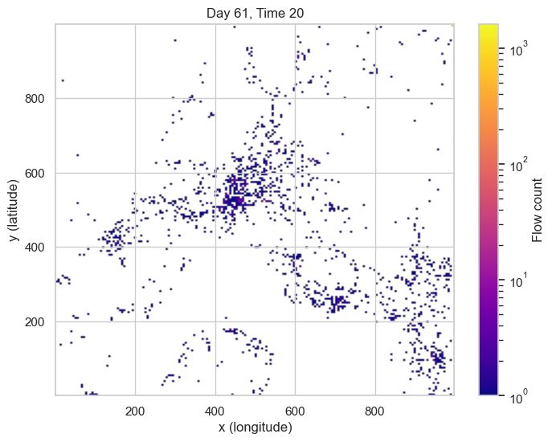

全時段加總熱圖，識別高人流節點：

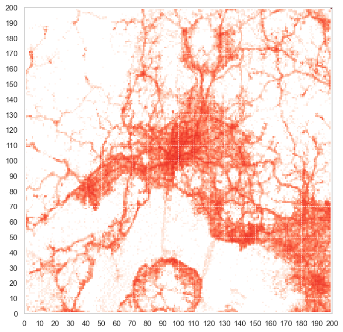

### 時序模式分析

全域時間序列（75 天連續）：

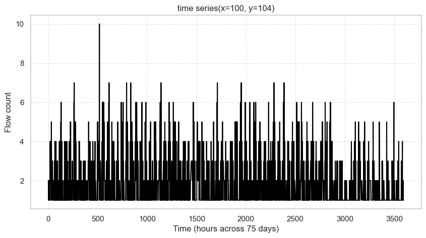

週次分解模式（每週 7 天 × 48 時間槽）：

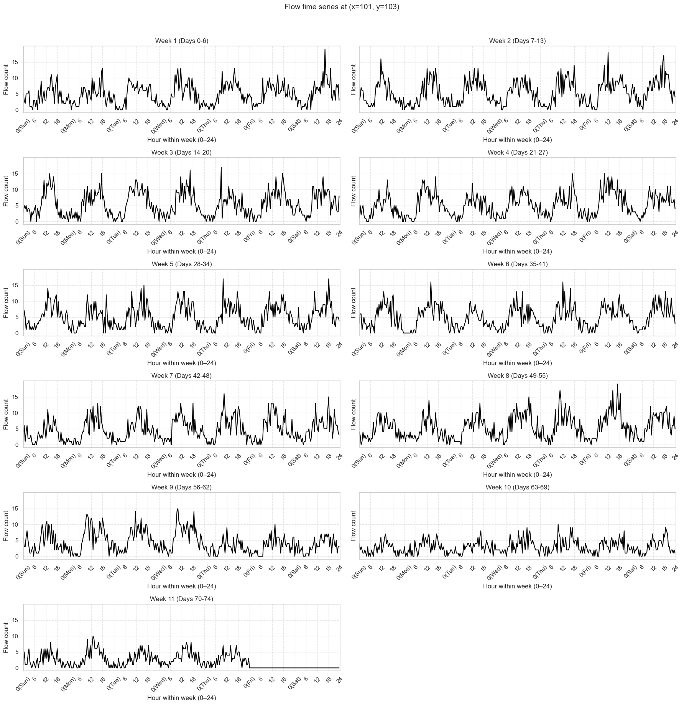

> 可觀察到工作日 8:00、12:00、16:00–18:00 三個高峰，符合日本大學作息規律。CityD（熊本）無明顯通勤峰值，反映較低密度的地方城市特性。

### 個人化特徵

依 22:00–06:00 最常出現位置推斷居住地，並統計各週次 × 星期的在家率：

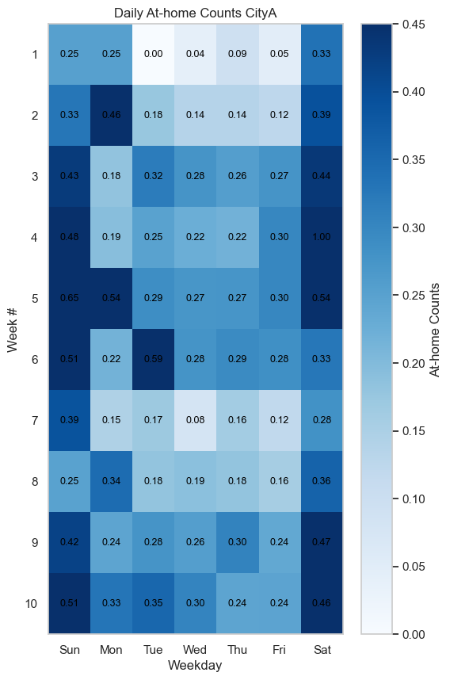

---

## 模型

### 1. LSTM（點位時序預測）

```
輸入：過去 48 個時間槽（= 1 天）的人流數
輸出：下一個時間槽的人流數
架構：LSTM(50) → Dense(1)
```

| 設定 | 值 |
| ---- | -- |
| Look-back | 48（1 天） |
| Hidden Units | 50 |
| Optimizer | Adam |
| Loss | MSE |
| Train / Val / Test | 70% / 10% / 20% |

各城市中心點（x, y）與主要聚落的時序切片均可套用，以下展示 **CityA 名古屋中心（135, 77）** 的預測結果：

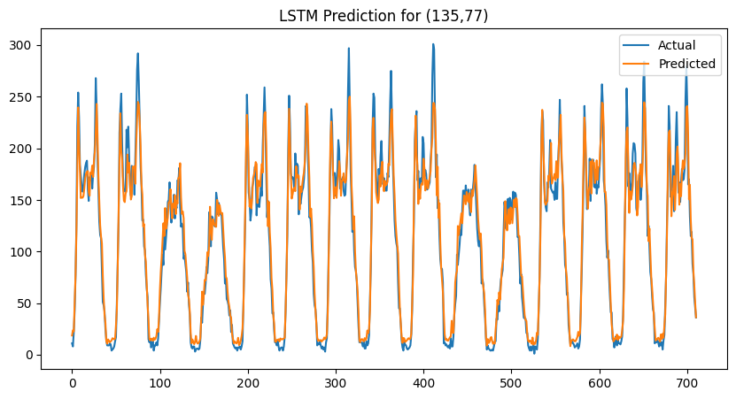

預測誤差分布（Test Set）：

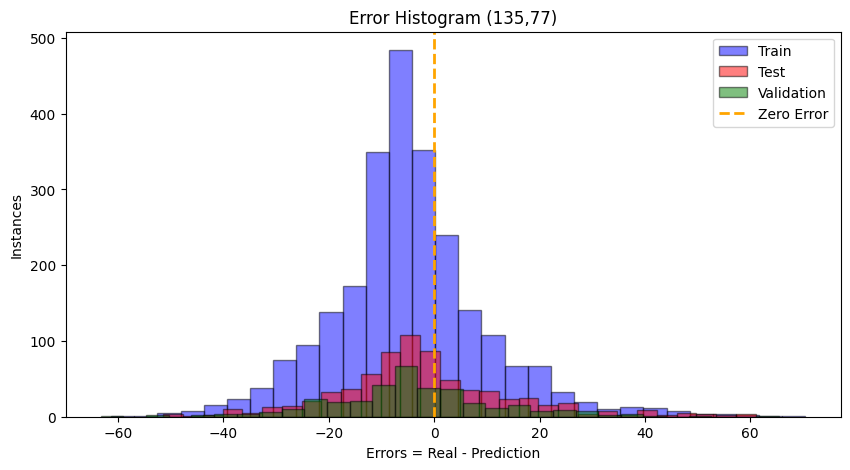

訓練與驗證 Loss 曲線（50 Epochs）：

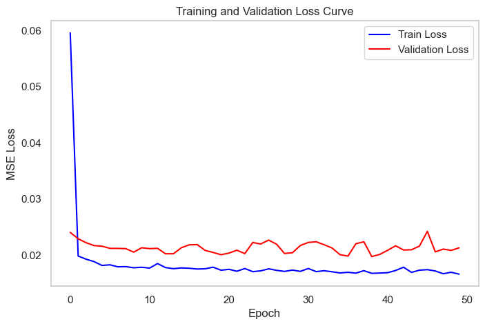

---

### 2. cGAN（空間 Patch 生成）

```
輸入：過去 48 步歷史（9×9 空間）+ 時間條件（one-hot 48 維）+ 隨機噪聲
輸出：下一時間槽的 9×9 人流 Patch
```

| 模組 | 架構 |
| ---- | ---- |
| Generator | Conv2D × 3 + 條件注入 + Sigmoid |
| Discriminator | Conv2D × 3（LeakyReLU）+ Dense(1) |
| 損失函數 | BCE（對抗）+ L1（重建，λ=100） |
| Optimizer | Adam（lr=2e-4, β₁=0.5） |

訓練 100 Epoch 後 Real vs Fake Patch 對比與 Loss 曲線（CityA 135,77）：

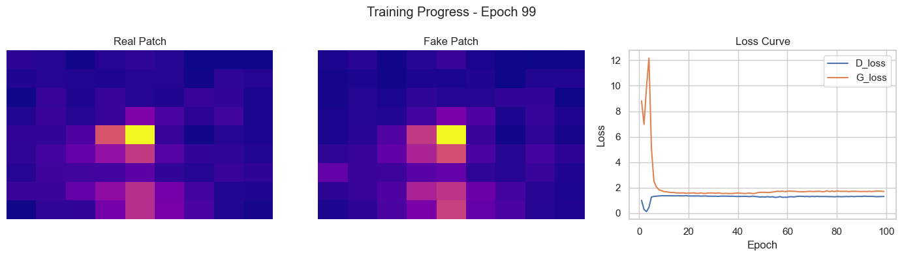

測試集 Real vs Fake 時序折線（CityA 135,77，正規化尺度）：

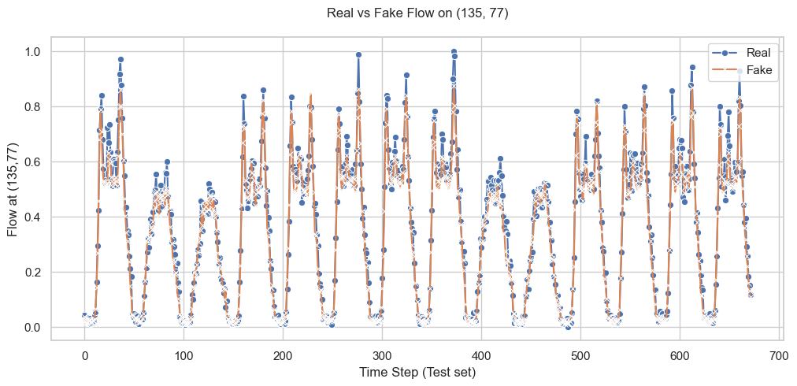

Batch Loss 曲線：

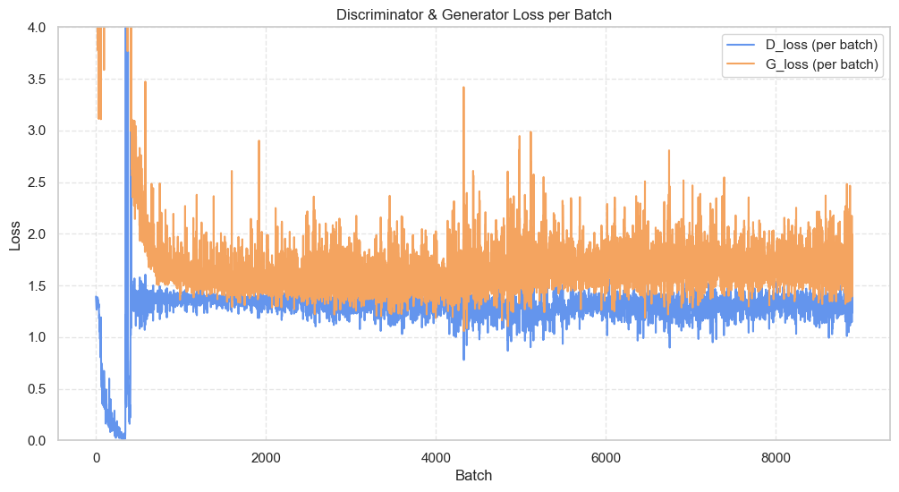

**各城市 cGAN 測試結果（原始尺度）：**

| 城市 | 位置（x, y） | Patch RMSE | Patch MAE |
| ---- | ----------- | ---------- | --------- |
| CityA（名古屋） | (135, 77) | 4.8154 | 2.9832 |
| CityB（廣島） | (79, 93) | 3.7244 | 2.4680 |
| CityC（札幌） | (24, 151) | 3.9610 | **2.4547** |
| CityD（熊本） | (101, 103) | 0.7533 | 0.3300 |

> CityD MAE 偏低係因熊本中心人流量本身較少（grid count 多在 0–20 之間），模型輸出接近 0 即可達到低誤差，並非模型真正優秀。高流量城市中 **CityC（札幌）MAE=2.4547** 為最佳表現。

---

### 3. Diffusion Model（條件空間生成）

```
輸入：含噪 Patch x_t + 條件（時間 one-hot 48 維 + 中心點人流）
輸出：預測噪聲 ε（U-Net）→ 反向去噪生成 9×9 Patch
```

| 設定 | 值 |
| ---- | -- |
| Timesteps | 1000 |
| Noise schedule | Linear（1e-4 → 0.02） |
| 架構 | U-Net（Encoder-Bottleneck-Decoder，含條件注入） |
| Optimizer | Adam（lr=1e-4） |
| 訓練 / 驗證 / 測試 | 80% / 10% / 10% |

真實 Patch 樣本（測試集輸入）：

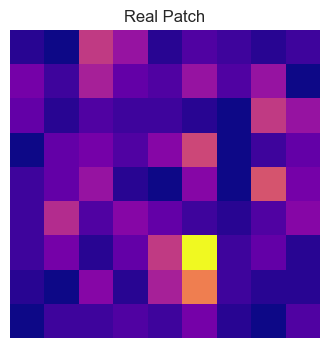

去噪生成過程（Real → Step 1 → Step 250 → Step 500 → Step 750 → Step 1000，CityA Epoch 70）：

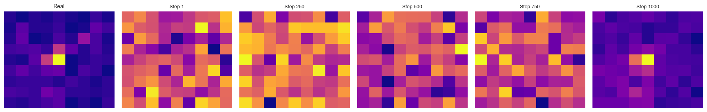

訓練 Loss 曲線：

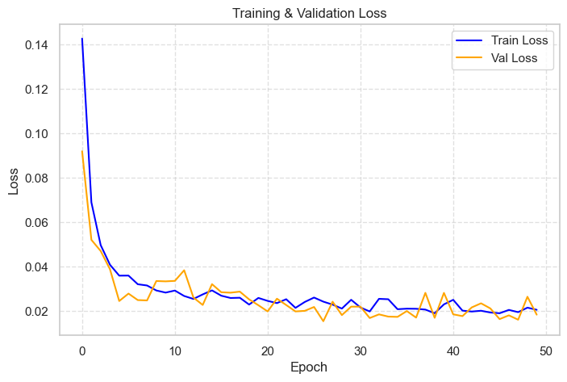

測試集 Real vs Generated 對比（5 個樣本）：

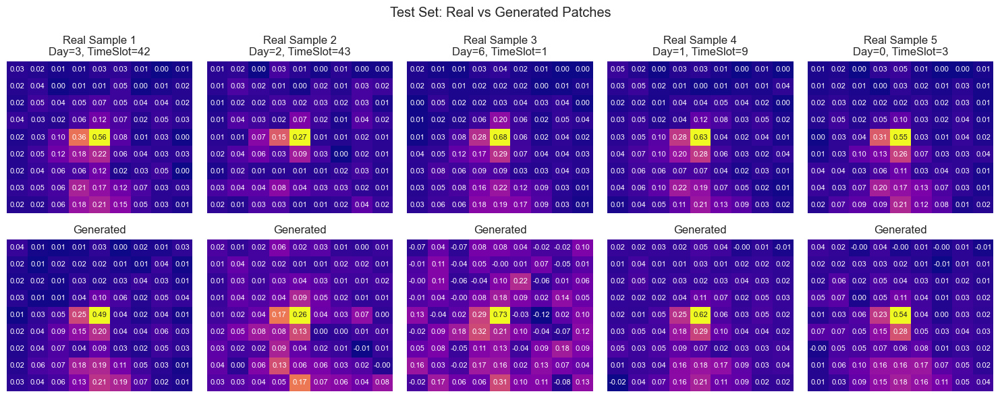

**各城市 Diffusion 測試結果（原始尺度）：**

| 城市 | 位置（x, y） | Test RMSE | Test MAE |
| ---- | ----------- | --------- | -------- |
| CityA（名古屋） | (135, 77) | 12.5921 | 7.6764 |
| CityB（廣島） | (79, 93) | 11.0347 | 6.9007 |
| CityC（札幌） | (24, 151) | 10.3687 | **6.2671** |
| CityD（熊本） | (101, 103) | 1.9078 | 1.2402 |

---

## 結果比較

| 模型 | 最佳城市 | Patch MAE | Patch RMSE | 備註 |
| ---- | -------- | --------- | ---------- | ---- |
| LSTM | CityD（熊本） | — | — | 點位時序預測，非 Patch 指標 |
| cGAN | CityC（札幌） | **2.4547** | 3.9610 | 100 Epochs，L1 loss λ=100 |
| Diffusion | CityC（札幌） | 6.2671 | 10.3687 | 100 Epochs，DDPM |

> cGAN 在空間 Patch 生成品質上明顯優於 Diffusion Model（MAE 約低 60%），Diffusion 模型尚有改進空間，可嘗試增加訓練輪數或調整條件注入方式。

---

## 訓練細節

- **資料前處理**（`pre_processing.py`）：從完整城市資料中擷取各城市中心 POI 周圍 9×9 的 Patch CSV（大幅降低記憶體需求）
- **正規化**：MinMaxScaler 對 count 欄位全域正規化至 [0,1]，評估時反還原
- **LSTM**：固定格點（x, y）的時序切片，全域時間索引連續編碼
- **cGAN**：以時間 one-hot 條件注入 Generator 和 Discriminator，L1 loss 控制空間結構
- **Diffusion**：DDPM 框架，linear noise schedule，U-Net 每層 skip connection 均 concatenate 條件向量，最終一步不加隨機擾動

---

## 專案結構

```
human-flow-forecasting/
├── 日本人流分析.ipynb       # 主程式：EDA + LSTM + cGAN + Diffusion
├── pre_processing.py        # 資料前處理，擷取 9×9 Patch
├── poi_finding.py           # POI 類別分析工具
├── weekly_flow_analysis.py  # 跨城市週流量比較視覺化
├── images/                  # README 圖片
└── poi_data/                # POI CSV 資料（需自行準備，已 .gitignore）
```

---

## 環境需求

```bash
pip install pandas numpy matplotlib seaborn scikit-learn tensorflow
```

| 套件 | 用途 |
| ---- | ---- |
| TensorFlow / Keras | LSTM、cGAN、Diffusion 建模 |
| pandas / numpy | 資料處理 |
| matplotlib / seaborn | 視覺化 |
| scikit-learn | MinMaxScaler、MAE/RMSE 評估 |

---

## 執行方式

```bash
# 1. 資料前處理（產生 _patch.csv）
python pre_processing.py

# 2. POI 分析
python poi_finding.py

# 3. 跨城市週流量比較
python weekly_flow_analysis.py

# 4. 主要建模（Jupyter）
jupyter notebook 日本人流分析.ipynb
```
